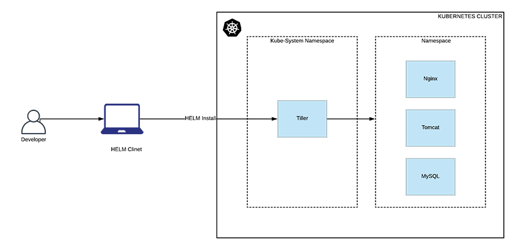

# Helm

## Prerequisites

Before using **kubectl**, please set the **KUBECONFIG** environment variable to point to the right kubeconfig file.

```console
$ export KUBECONFIG=../02-Multi-node_cluster/vagrant/kubeconfig.yaml
```



## Helm (CLI) installation

On *nix

```console
$ curl https://raw.githubusercontent.com/helm/helm/master/scripts/get-helm-3 | bash
```

On MacOS (using Homebrew)

```console
$ brew install kubernetes-helm
```

On Windows (using Chocolatey)

```console
$ choco install kubernetes-helm
```

## Helm configuration

Create Tiller Service Account With Cluster Admin Permissions

```console
$ kubectl apply -f helm-rbac.yaml 
serviceaccount/tiller created
clusterrolebinding.rbac.authorization.k8s.io/tiller created
```


## Helm initialization (Tiller deployment)

Let's install the Tiller component (the Helm backend)

```console
$ helm init --service-account=tiller 
$HELM_HOME has been configured at /Users/denismaggiorotto/.helm.

Tiller (the Helm server-side component) has been installed into your Kubernetes Cluster.
```

You can check the tiller deployment in the kube-system namespace using kubectl.

```console
$ kubectl get deployment tiller-deploy -n kube-system
NAME            READY   UP-TO-DATE   AVAILABLE   AGE
tiller-deploy   1/1     1            1           4m54s
```

You can also check che Helm-to-Tiller communication using the following command.

```console
$ helm ls

```

An empty response is expected at this point since we did not install anything yet.

## Deployment prerequisites

We are going to install a Kafka cluster (3 pods for Kafka + 3 pods for Zookeeper) to show how Helm simplifies complex architecture  installation.

Since Kafka needs a StorageClass, please apply everything in the lab 12 with the following command:

```console
$ kubectl apply -f ../12-StorageClass/.
service/nfs-provisioner created
serviceaccount/nfs-provisioner created
deployment.apps/nfs-provisioner created
storageclass.storage.k8s.io/nfs-dynamic created
persistentvolumeclaim/nfs created
clusterrole.rbac.authorization.k8s.io/nfs-provisioner-runner created
clusterrolebinding.rbac.authorization.k8s.io/run-nfs-provisioner created
role.rbac.authorization.k8s.io/leader-locking-nfs-provisioner created
rolebinding.rbac.authorization.k8s.io/leader-locking-nfs-provisioner created
```


## Deploy a sample app using Helm

Let's inspect the initial repo/s configured on Helm.

```console
$ helm repo list
NAME            URL                                             
stable          https://kubernetes-charts.storage.googleapis.com
```

Sometimes, Charts are available on repos not known by default by Helm, so we have to add a new one:

```console
$ helm repo add confluentinc https://confluentinc.github.io/cp-helm-charts/ 
"confluentinc" has been added to your repositories
```

Update the repos

```console
$ helm repo update
Hang tight while we grab the latest from your chart repositories...
...Successfully got an update from the "confluentinc" chart repository
...Successfully got an update from the "stable" chart repository
Update Complete.
```

I provided to you a [values.yaml](values.yaml) file with some variable overrides:

```yaml
cp-schema-registry:
  enabled: false
cp-kafka-rest:
  enabled: false
cp-kafka-connect:
  enabled: false
cp-zookeeper:
  enabled: true
  servers: 3
  persistence:
    enabled: true
    dataDirStorageClass: "nfs-dynamic"
    dataLogDirStorageClass: "nfs-dynamic"
cp-kafka:
  enabled: true
  brokers: 3
  persistence:
    enabled: true
    storageClass: "nfs-dynamic"
```

This values.yaml file will be used when installing the chart.

```console
$ helm install --name my-kafka --values=values.yaml confluentinc/cp-helm-charts
NAME:   my-kafka
LAST DEPLOYED: Wed Nov 20 00:49:56 2019
NAMESPACE: default
STATUS: DEPLOYED

RESOURCES:
==> v1/ConfigMap
NAME                                            AGE
my-kafka-cp-kafka-jmx-configmap                 0s
my-kafka-cp-ksql-server-jmx-configmap           0s
my-kafka-cp-ksql-server-ksql-queries-configmap  0s
my-kafka-cp-zookeeper-jmx-configmap             0s

==> v1/Pod(related)
NAME                                     AGE
my-kafka-cp-kafka-0                      0s
my-kafka-cp-ksql-server-7f9cb89b4-m48tk  0s
my-kafka-cp-zookeeper-0                  0s

==> v1/Service
NAME                            AGE
my-kafka-cp-kafka               0s
my-kafka-cp-kafka-headless      0s
my-kafka-cp-ksql-server         0s
my-kafka-cp-zookeeper           0s
my-kafka-cp-zookeeper-headless  0s

==> v1beta1/PodDisruptionBudget
NAME                       AGE
my-kafka-cp-zookeeper-pdb  0s

==> v1beta1/StatefulSet
NAME                   AGE
my-kafka-cp-kafka      0s
my-kafka-cp-zookeeper  0s

==> v1beta2/Deployment
NAME                     AGE
my-kafka-cp-ksql-server  0s
...
```

```console
$ helm list
NAME            REVISION        UPDATED                         STATUS          CHART                   APP VERSION     NAMESPACE
my-kafka        1               Wed Nov 20 00:46:34 2019        DEPLOYED        cp-helm-charts-0.1.0    1.0             default  
```

```console
$ kubectl get pvc                                                        
NAME                                 STATUS   VOLUME                                     CAPACITY   ACCESS MODES   STORAGECLASS   AGE
datadir-0-my-kafka-cp-kafka-0        Bound    pvc-5eb40135-66d4-4651-a3d8-3c5aff99ae8d   5Gi        RWO            nfs-dynamic    16s
datadir-0-my-kafka-cp-kafka-1        Bound    pvc-320038d1-5093-4c2c-bbed-2c06b6182c9e   5Gi        RWO            nfs-dynamic    9s
datadir-my-kafka-cp-zookeeper-0      Bound    pvc-a5648755-4765-4e85-adc3-4b4205bb8f2a   5Gi        RWO            nfs-dynamic    16s
datadir-my-kafka-cp-zookeeper-1      Bound    pvc-8d6ed9d2-e2e8-4f4a-adeb-114326f515ad   5Gi        RWO            nfs-dynamic    11s
datalogdir-my-kafka-cp-zookeeper-0   Bound    pvc-2d2f0985-d30b-438c-8684-38efb30ff799   5Gi        RWO            nfs-dynamic    16s
datalogdir-my-kafka-cp-zookeeper-1   Bound    pvc-1b3d3c3f-5bfe-4653-a031-30773ea5a4fa   5Gi        RWO            nfs-dynamic    11s
nfs                                  Bound    pvc-951e5d17-2b4d-4999-ab83-c8b69b112cb3   1Mi        RWX            nfs-dynamic    64m
```

```console
$ 
kubectl get po 
NAME                                      READY   STATUS    RESTARTS   AGE
my-kafka-cp-kafka-0                       2/2     Running   0          32s
my-kafka-cp-kafka-1                       2/2     Running   0          25s
my-kafka-cp-kafka-2                       0/2     Running   0          14s
my-kafka-cp-ksql-server-7f9cb89b4-kk6m4   2/2     Running   2          32s
my-kafka-cp-zookeeper-0                   2/2     Running   0          32s
my-kafka-cp-zookeeper-1                   2/2     Running   0          27s
my-kafka-cp-zookeeper-2                   2/2     Running   0          16s
nfs-provisioner-77bb4bd457-pbxlm          1/1     Running   0          64m
```

Remove everything:

```console
$ helm delete --purge my-kafka
release "my-kafka" deleted
```

```console
$ 
release "my-kafka" deleted
```

```console
$ kubectl delete -f ../12-StorageClass/.
service "nfs-provisioner" deleted
serviceaccount "nfs-provisioner" deleted
deployment.apps "nfs-provisioner" deleted
storageclass.storage.k8s.io "nfs-dynamic" deleted
persistentvolumeclaim "nfs" deleted
clusterrole.rbac.authorization.k8s.io "nfs-provisioner-runner" deleted
clusterrolebinding.rbac.authorization.k8s.io "run-nfs-provisioner" deleted
role.rbac.authorization.k8s.io "leader-locking-nfs-provisioner" deleted
rolebinding.rbac.authorization.k8s.io "leader-locking-nfs-provisioner" deleted

```


